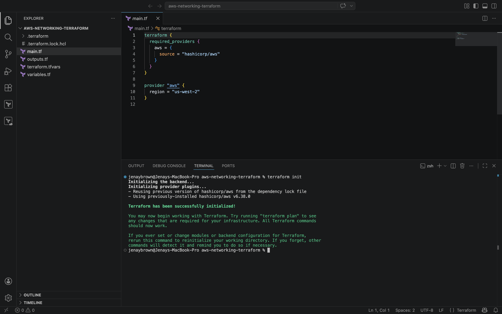
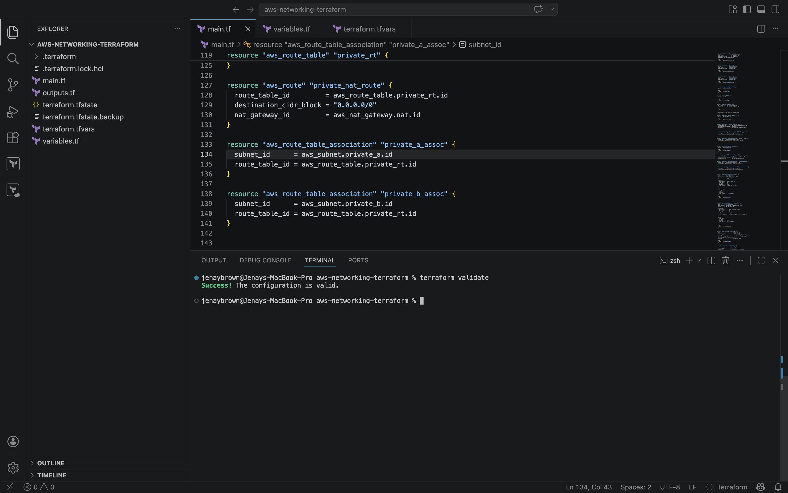
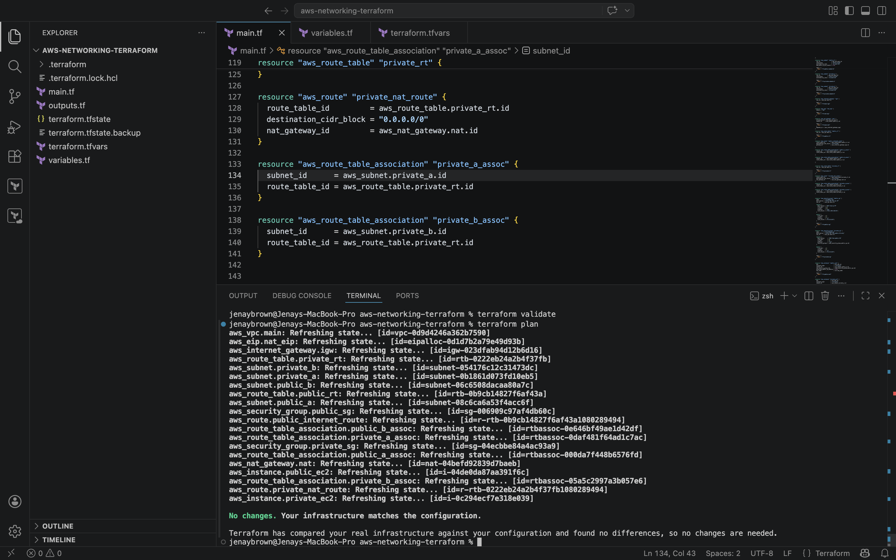
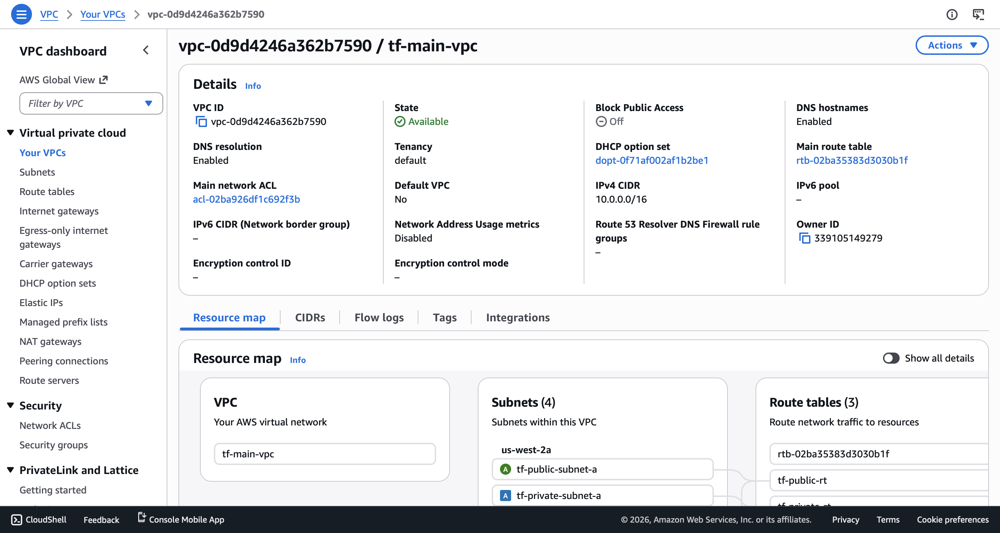
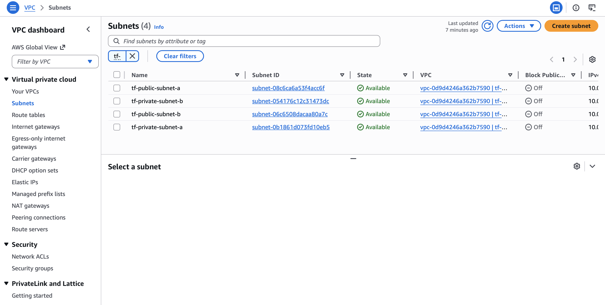
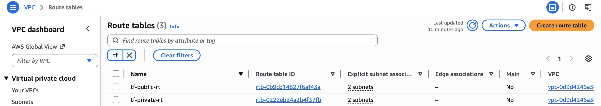
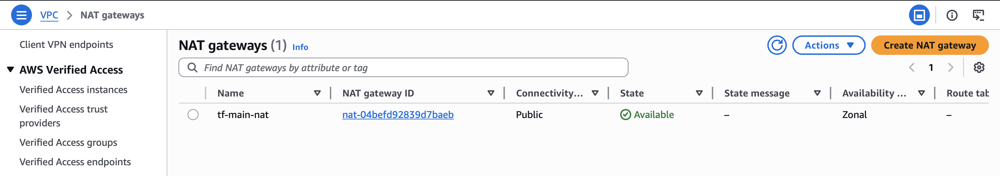
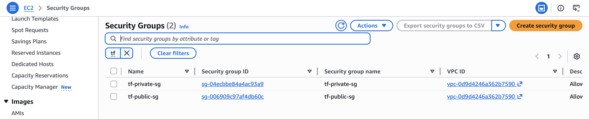
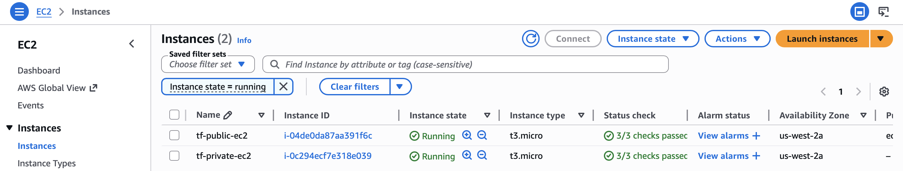
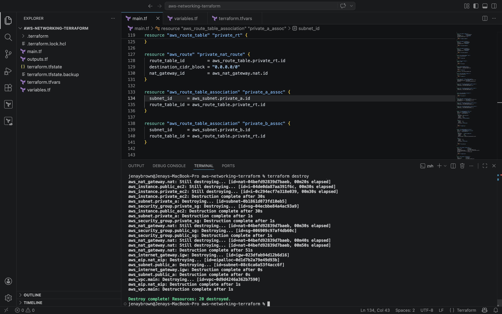

# AWS Networking Infrastructure with Terraform

## Project Overview

This project provisions a custom AWS networking environment in AWS using Terraform.

It was built to demonstrate foundational cloud and infrastructure-as-code skills, including VPC design, subnet segmentation, route table associations, internet and NAT gateway configuration, security groups, and EC2 deployment.

The environment includes both public and private networking components to reflect how resources are commonly separated and controlled in real AWS environments.

---

## Architecture Components

This project deploys:

- 1 custom VPC
- 2 public subnets
- 2 private subnets
- 1 internet gateway
- 1 NAT gateway
- 1 Elastic IP
- 1 public route table
- 1 private route table
- 2 security groups
- 1 public EC2 instance
- 1 private EC2 instance

---

## Terraform Files

### `main.tf`
Defines the AWS infrastructure resources.

### `variables.tf`
Defines reusable input variables such as:

- `ami_id`
- `key_name`

### `terraform.tfvars.example`
Shows the expected variable values needed to deploy the project.

### `outputs.tf`
Can be used to display useful resource outputs after deployment.

---

## Terraform Workflow Used

### Initialize Terraform
Run: `terraform init`

Initializes the Terraform working directory and downloads the required AWS provider and plugins.

### Validate Configuration
Run: `terraform validate`

Checks whether the Terraform configuration is syntactically valid before deployment.

### Review Execution Plan
Run: `terraform plan`

Shows the infrastructure changes Terraform plans to make before resources are created.

### Deploy Infrastructure
Run: `terraform apply`

Creates the AWS networking resources defined in the configuration.

### Destroy Infrastructure
Run: `terraform destroy`

Deletes all provisioned resources after testing to avoid unnecessary AWS charges.

---

## Key Concepts Demonstrated

- Infrastructure as Code (IaC)
- AWS VPC architecture
- Public vs private subnet design
- Route table associations
- Internet Gateway vs NAT Gateway
- EC2 deployment with subnet placement
- Security group configuration
- Terraform lifecycle workflow
- Resource cleanup and cost awareness

---

## Screenshots

### Terraform Init

### Terraform Validate

### Terraform Plan

### VPC

### Subnets

### Route Tables

### NAT Gateway

### Security Groups

### EC2 Instances

### Terraform Destroy

---

## Notes

- This project was designed to demonstrate AWS networking and Infrastructure as Code skills using Terraform.
- Resources were destroyed after deployment to avoid ongoing AWS charges.
- The private EC2 instance was placed in a private subnet to demonstrate controlled outbound internet access through a NAT gateway.
- The public EC2 instance was placed in a public subnet to demonstrate internet-accessible placement.
- Block Public Access at the VPC level was left off because this project focused on network design, subnet segmentation, route behavior, and connectivity rather than production hardening controls.usage, and connectivity behavior rather than production hardening.

